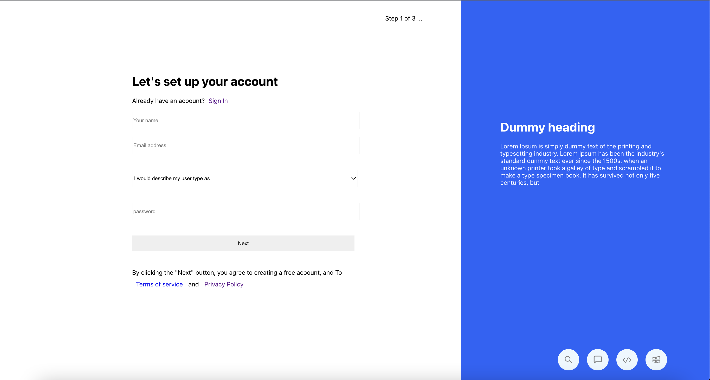

#myUI

## Screenshot

## Built With
- Major Languages: JAVASCRIPT, HTML, CSS
- Major Technologies : Git, Github, Webpack, React, Redux

### Prerequisites
- npm ( Node Package Manager )
- git and Github Account

### Run project
- Now run the following:
 `npm install`  - on the root directory of the project to install the required packages
 `npm start`   - on the root directory of the project to start the project 

## Authors

👤 **Richard Opiyo**

- GitHub: [@richardoppiyo](https://github.com/richardoppiyo)
- Twitter: [@blessed_ricky](https://twitter.com/blessed_ricky)
- LinkedIn: [Richard Opiyo](https://linkedin.com/in/richardoppiyo)

## Show your support

Give a ⭐️ if you like this project!

## Acknowledgments

- To morning session team,reviewers and standup team members.
- Design by [Invision](https://projects.invisionapp.com/share/K7V8HV6Q9HM#/screens/397486262)

## 📝 License

This project is [MIT](./MIT.md) licensed.
